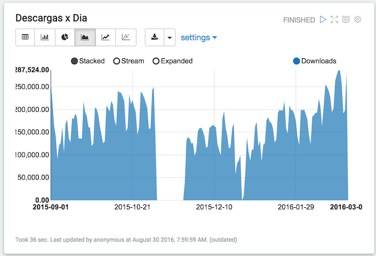
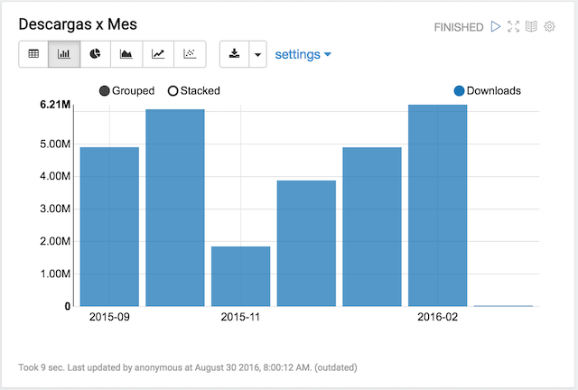
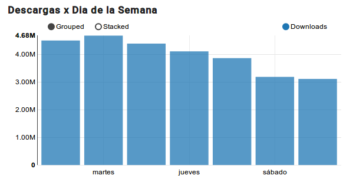
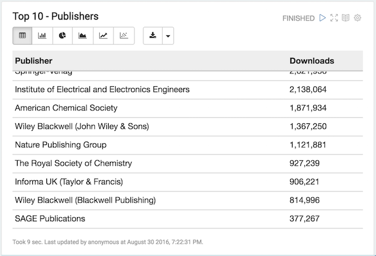
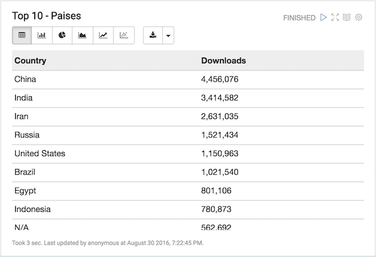
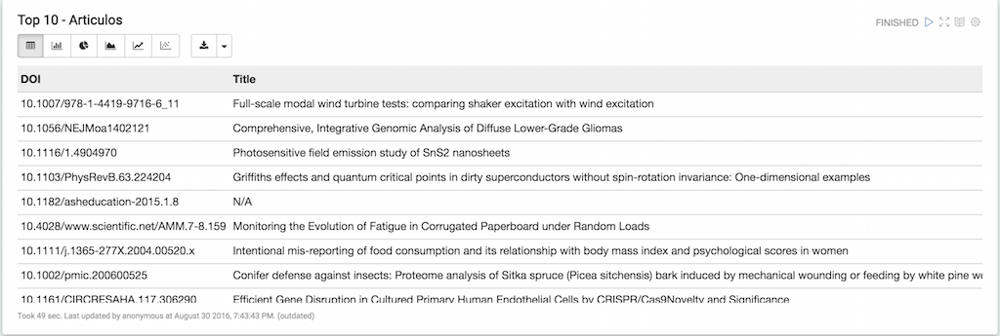
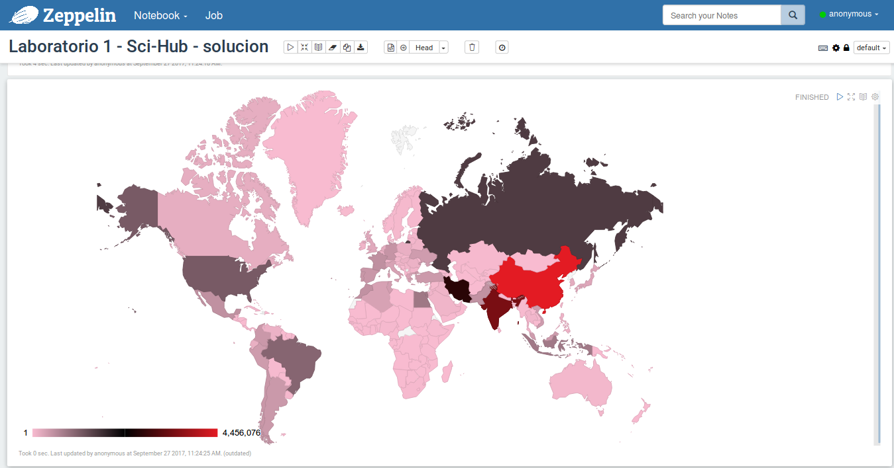
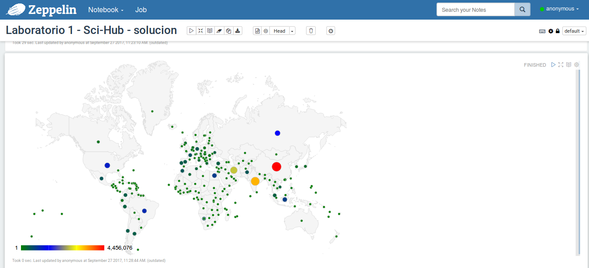
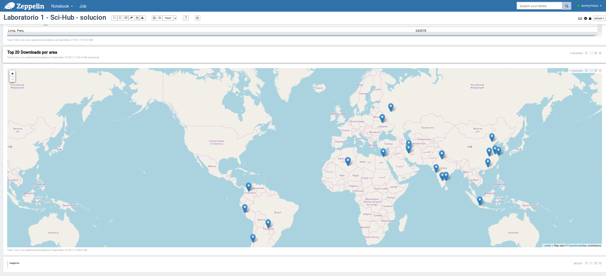

# Laboratorio 1: Conociendo a Sci-Hub

En este laboratorio analizaremos los logs de descarga de **[Sci-Hub](http://sci-hub.cc/)**.

Según [Wikipedia](https://en.wikipedia.org/wiki/Sci-Hub):

> **Sci-Hub** es un motor de búsqueda especializado que permite la descarga directa y gratuita de más de 51.000.000 de artículos científicos. 
> 
> Sci-Hub fue fundado por Alexandra Elbakyan de Kazajistán el 5 de septiembre de 2011, como reacción contra el alto costo de compra de los artículos académicos. 

Desde su introducción Sci-Hub ha causado un gran revuelo principalmente entre las grandes editoriales (Elsevier, Springer, etc.) quienes han presentado reiteradas demandas legales, exigiendo el cierre de Sci-Hub, alegando violaciones a los derechos de propiedad intelectual.

En este laboratorio reproduciremos parte del análisis  realizado en el artículo [Who's downloading pirated papers? Everyone](http://www.sciencemag.org/news/2016/04/whos-downloading-pirated-papers-everyone) [1], el cual analiza los logs de descarga de Sci-Hub intentado responder preguntas sobre que se descarga, que editoriales se ven mas afectadas y desde donde se realizan las descargas.

## Dataset

Para este laboratorio usaremos un dataset, que contiene el log de descargas de Sci-Hub, disponible en [2] y en [Archivos de prueba](https://cs.famaf.unc.edu.ar/~damian/bigdata/curso/posgrado_optativa/lectivo/doc/lab-1/scihub_data.tbz):

> ...These data are from the Sci-Hub server logs from 1 September 2015 through 29 February 2016. They include 28 million download requests with timestamps, geolocations (latitude, longitude), and the Digital Object Identifiers (DOI) of each document requested for download. The geolocation is the result of a clustering algorithm that mapped the Internet Protocol (IP) addresses of all users to their nearest city geolocation, based on data from Maxmind and the Google Maps API. The original IP addresses of users are not included. These data provide the first global view of the readership of the world's largest online, open source scholarly library.

## Consignas

* **Fecha de Entrega:** 4/10/2017 a las 12 de la noche.
* **Formato de entrega:** Se debe comitear al repositorio del grupo el notebook de Zeppelin con el tag `lab-1`. 
  En [lab-1.json](https://cs.famaf.unc.edu.ar/~damian/bigdata/curso/posgrado_optativa/lectivo/laboratorios/lab-1/lab-1.json) hay un esqueleto de notebook para completar.
  Utilizar Zeppelin version 0.7.3.
* **Restricciones:** Solo se pueden utilizar RDDs. 

## Análisis: Primera Etapa

Comenzaremos realizando un análisis de frecuencia para conocer la frecuencia de descarga por día, mes y día de la semana.

1. Lo primero que debemos hacer es cargar nuestro dataset. Implemente la siguiente función:

	```scala
	 /** Carga un archivo en memoria y retorna un RDD. 
	  *  
	  *  @param 	file				Path al archivo 
	  *  @return	RDD[Array[String]]	Cada Array[String] tiene 6 elementos:
	  *  								date, doi, ip_code, country, city, coords
	 */
	 def loadFile(file : String) : RDD[Array[String]]
	
	```
 
2. Como el dataset se encuentra dividido en varios archivos debemos encargarnos de ensamblarlo antes de procesarlo. Implemente la siguiente función:

	```scala
	/** Carga una lista de archivos en memoria y retorna un único 
	  * RDD[Array[String]] con el contenido de todos los archivos. 
	  *  
	  *  @param 	files				Lista de paths
	  *  @return	RDD[Array[String]]	Cada Array[String] tiene 6 elementos:
	  *  								date, doi, ip_code, country, city, coords
	 */
	def loadDataset(files : List[String]) : RDD[Array[String]]
	```


3. Ahora que tenemos los datos, lo primero que haremos es transformar el dataset de forma tal que nos permita luego agregar por mes, semana y día. Implemente la siguiente función:

	```scala
	/** Transforma un RDD[Array(String)] en un RDD[(DateTime,Int)].
	  *  
	  *  @param 	raw					Dataset "crudo" de sci-hub.
	  *  @return	RDD[(LocalDate,Int)]	
	 */
	def toDateTuple(raw: RDD[Array[String]]) : RDD[(LocalDate,Int)]
	```
	**Recomendación:** Para manipular fechas se recomienda usar: [nscala-time](https://github.com/nscala-time/nscala-time) el cual es un wrapper de [joda-time](http://www.joda.org/joda-time/). `LocalDate` es un tipo provisto por joda-time.
 
4. Ahora podemos calcular la cantidad de descargas  por día, por mes y por día de la semana. Implemente las siguientes funciones:
	
	```scala
	def aggregateByDay(...)
	
	def aggregateByMonth(...)
	
	def aggregateByWeekDay(...)
	```
	**Recomendación:** Antes de implementar las funciones piense cual es el flujo de procesamiento más eficiente.

5. Finalmente, utilice las funciones desarrolladas para obtener las siguientes visualizaciones en **Zeppelin**:






## Análisis: Segunda Etapa

Ahora nos centraremos en conocer cuales son las editoriales, los artículos y los países con mas descargas.

1. Lo primero que tenemos que saber es que todo DOI (Digital Object Identifier) tiene la siguiente sintaxis `prefix/object`, donde el `prefix` identifica a la editorial. Por ejemplo, en el DOI `10.1126/science.352.6285.508`, `10.1126` representa el ID de la editorial mientras que `science.352.6285.508` representa el ID del objeto.
En [2], además de los logs, existe un pequeño dataset en formato CSV, llamado [**Sci-Hub publisher DOI prefixes**](https://cs.famaf.unc.edu.ar/~damian/bigdata/curso/posgrado_optativa/lectivo/doc/lab-1/publisher_DOI_prefixes.csv),  que contiene el mapeo de prefijo a editorial, el cual necesitaremos más adelante. Implemente la siguiente función:
	
	```scala
	/** Carga un archivo contiene el mapeo prefix -> publisher.
	*  
	*  @param 	file					Path al archivo.
	*  @return	Map[String,String] 	
	*/
	def loadPrefixMapping(file : String) : RDD[(String, String)]
	```


**Recomendación:** Si tiene problemas para parsear el CSV no dude en utilizar alguna librería especifica para dicha tarea, como ser [Opencsv](http://opencsv.sourceforge.net/). 
En [BasicParseCsv.scala](https://github.com/databricks/learning-spark/blob/master/src/main/scala/com/oreilly/learningsparkexamples/scala/BasicParseCsv.scala) y en el libro "Learning Spark - Lightning-Fast Big Data Analysis" capitulo 5 pag. 77 se explica como hacerlo.

2. Ahora podemos calcular la cantidad de descargas  por editorial, por articulo y por país. Implemente las siguientes funciones:
	
	```scala
	def aggregateByPrefix(...)
	
	def aggregateByDoi(...)
	
	def aggregateByCountry(...)
	```
**Recomendación:** Antes de implementar las funciones piense cual es el flujo de procesamiento más eficiente.

3. Una vez que tenga la información de descargas por DOI necesitaremos acceder a la metadata asociada a cada DOI (Title, Year, Publisher, Book y  Subject). Para ello utilice el servicio provisto por `https://data.crossref.org` para acceder a la metadata. Implemente la siguiente función:
	
	```scala
	/** Retorna la metadata asociada a un DOI
	*  
	*  @param 	doi					DOI
	*  @return	... 	
	*/
	def getMetadata(doi : String)
	```

	 **Recomendaciones:** 
	 * Puede encontrar útil la librería [scalaj-http](https://github.com/scalaj/scalaj-http) para hacer los request a la API.
	 * No se complique con el parsing de JSON, use la librería que viene con scala. Es fea y poco elegante, pero sirve para lo que se necesita hacer.
     * Analice si es más eficiente trabajar con operaciones por partición (`mapPartitions`).

4. Finalmente utilice las funciones desarrolladas para obtener las siguientes visualizaciones en **Zeppelin**:





**Nota:** En la última tabla no se ven todas las columnas, pero la misma contiene toda la metadata obtenida para un DOI.

## Análisis: Tercera Etapa (para posgrado)

Esta tercera etapa es obligatoria para alumnos de posgrado y para aquellos **"que se animen"!**

1. En la segunda etapa guarde el mapeo de prefijo a editorial en una variable broadcast en vez de un RDD.

2. Grafique en un mapa en el mismo Zeppelin la información de downloads por paises.




## Análisis: Cuarta Etapa (para todo el que se anime)

Esta cuarta etapa es solo para aquellos **"que se animen"!**

1. El dataset contiene información de geolocalización (coordenadas) que mapea la IP desde donde se hizo la descarga a la ciudad más cercana. Reproduzca el análisis hecho en [2] para  obtener las descargas por coordenada geográfica. 

2. Grafique tambien en un mapa la información.



 **Recomendaciones:** 
 
 * Antes de poder usar las coordenadas hay que realizar varias tareas de normalización. Lea con detenimiento el notebook disponible en [2] para ver como lo hace. 
 * Si encuentra una alternativa mejor, no dude en implementarla.
 
## Referencias


**[1]** Bohannon J (2016). ***Who's downloading pirated papers? Everyone.*** Science 352(6285): 508-512. [http://dx.doi.org/10.1126/science.352.6285.508](http://dx.doi.org/10.1126/science.352.6285.508)

**[2]** Elbakyan A, Bohannon J (2016). ***Data from: Who's downloading pirated papers? Everyone***. Dryad Digital Repository. [http://dx.doi.org/10.5061/dryad.q447c](http://dx.doi.org/10.5061/dryad.q447c)

